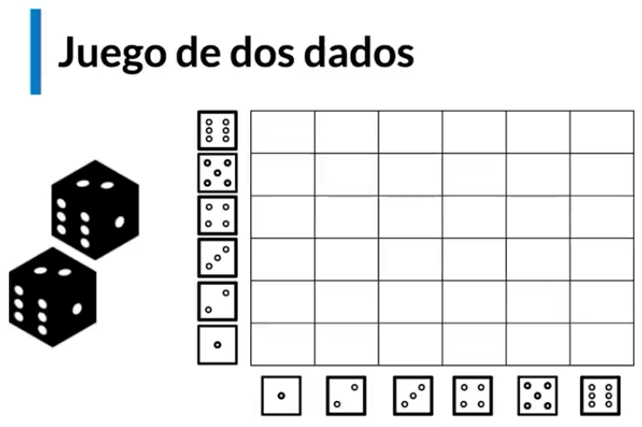
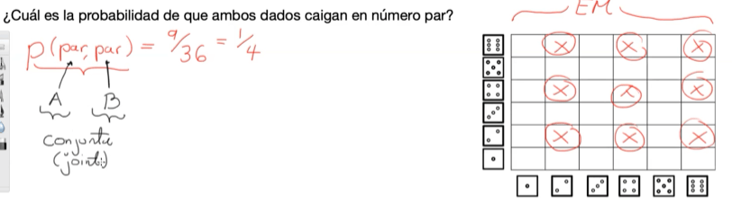
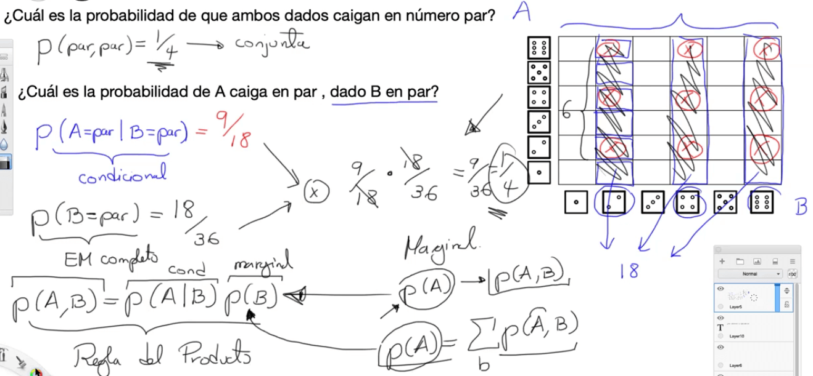

Hay tres tipos de probabilidad

- Conjunta (joint)
- Marginal
- Condicional

Debido a la confusión de estos conceptos, se explicaran con el juego de dos dados

El espacio muestral es la malla que se observa, donde filas y columnas muestran las posibles combinaciones de los dos dados, que son 36 en total.

¿Cuál es la probabilidad de que ambos dados caigan en número par?

La probabilidad es de 9/36, es decir 1/4. es este caso es lo que se hace es contar las probabilidades de las probabilidad de los dos en el espacio muestral, a esto se le conoce como probabilidad conjunta, o 'join' en inglés.

¿Cuál es la probabilidad de A caiga en par, dado B en par?

En este caso se asume que un dado ya es par, por lo que el espacio muestral se convierte en toda la columna donde el dado es par, para este caso 18 posibilidades, y las posibilidades son 9, por lo tanto la posibilidad es 9/18 o 1/2. Es de anotar que el simbolo | significa 'dado que'. A esto se le conoce como probabilidad condicional, también se puede  se calcular la probabilidad de B par, que para este caso es 18/36 o 1/2. Al multiplicar estas dos probabilidades se obtiene la probabilidad conjunta, el cuál es la regla del producto.

La probabilidad marginal es la probabilidad de un dado independiente de la probabilidad del otro dado.

Por tanto la probabilidad conjunta es:

$P(A,B) = P(A \& B) = P(A \cap B)$

La probabilidad condicional es:

$P(A \ dado \ B) = P(A|B)$

La regla del producto es:

$P(A \cap B) = P(A|B)P(B)$