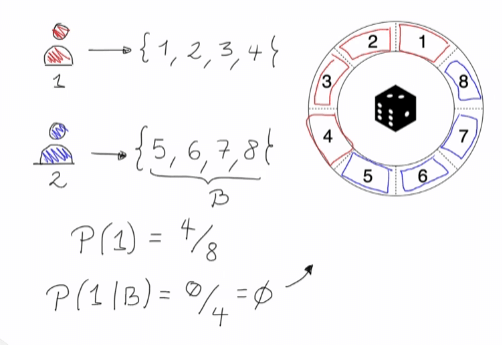

# EJEMPLO DE CÁLCULO DE PROBABILIDAD

## Correlaciones de eventos

Se quiere saber los resultados de:

- A = {el resultado de lanzar un dado es 4}
- B = {el resultado de lanzar un dado es par}
- C = {el resultado de lanzar un dado es impar}

Se empieza por saber la posibilidad de un evento sencillo sin ninguna condicional, para el primera posibilidad A, es de 1/6. 

Ahora, la posibilidad de obtener un número, si ya se sabe que cayo par, es de:

Esto sucede porque sabemos que es par, es decir, la muestra baja a 3, y de estos solo queda una . Esta probabilidad es mas alta que la primera probabilidad A, esto muestra que le hecho de que B haya ocurrido, aumenta las posibilidades de que aumente A, los que significa que los eventos  A y B estan positivamente correlacionados.

Ahora, imagina que sucede C, es decir, cae un número impar, por tanto no hay posibilidad de que haya caido A porque la probabilidad de A es excluyente de C, porque el espacio muestral de C no contiene el elemento A

Esto significa que A y C estan negativamente correlacionados. Esto muestra que el hecho de que sean excluyentes, no significa que dos probabilidades sean independientes, para este caso son muy dependientes uno del otro.

Juego de ruleta

Se tiene dos jugadores que juegan en la ruleta, la ruleta tiene 8 espacios donde puede caer una pelota, cada jugador puesta cada uno por 4 casillas.

El jugador 1 será el jugador rojo y el jugador 2 es el jugador azul, los dos jugadores son excluyentes, ya que un numero de uno no lo tiene el otro. Primero se calcula la probabilidad de que gane el jugador 1. De ahora en adelante el los numeros jugador 1 es A y del 2  es B

Se sigue con la probabilidad de que gane A dado que cayó B

Esto es un evento excluyente

Ahora se cambia la decisión del jugador 2, donde su espacio de muestra es 4,5,6,7, compartiendo con A el elemento 4. 

Por tanto la probabilidad, de que gane el jugador 1, sabiendo que la pelota cayo en un espacio del jugador 2 es:

Dado que esta probabilidad es menor a la probabilidad P(A), que es 1/2, se puede concluir que A y B son eventos negativamente correlacionados.