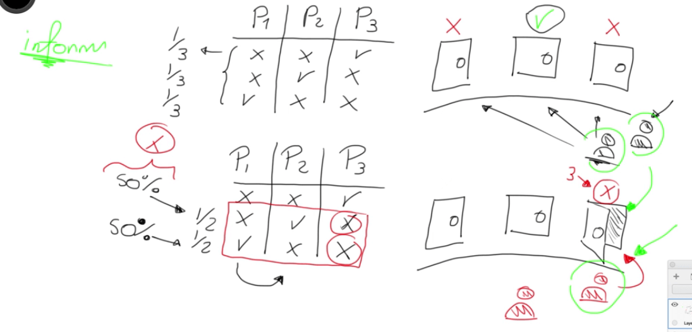
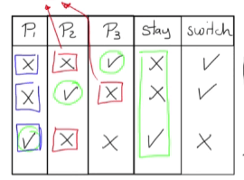

# EJEMPLO AVANZADOS CON PROBABILIDAD

## Paradoja ¿niño o niña?

- Una mujer tiene dos bebés donde el mayor es un varón.
- Una mujer tiene dos bebés donde uno de ellos es varón.

A primera vista parece que la información es la misma, que la mujer tiene dos bebés y uno es varón, pero tienen un sutil cambio gramatical que cambia las probabilidades por completo.

La pregunta a contestar es:

¿Cuál es la probabilidad de esta mujer tenga dos hijos varones?

El espacio muestral consta de dos variables, el primer niño con dos sexos, y un segundo niño también con dos sexos, por tanto el espacio muestral es de 2x2, 4 posibilidades. Por tanto la probabilidad de que los dos sean varones es:

Se resuelve la pregunta con la primera información, es decir, que el mayor es varón.

Dado que ya sabemos que el primero es varón, el espacio muestral consta de 2 elementos, por tanto la probabilidad se convierte en 1/2.

Con respecto a la segunda información, donde uno de ellos es varón, cambia totalmente, ya que el espacio muestral se a amplia a 3 y la posibilidad de que los dos sean varones es:

El problema de Monthy Hall

La paradoja consiste en que un participante tiene tres puertas al frente, el cuál solo uno de ellos tenía un premio sorpresa. 

Sin ninguna información la probabilidad de seleccionar la puerta correcta es de 1/3, pero cuando el participante escogía la puerta, el presentador abría una de la puerta que no había seleccionado el participante y que no tiene el premio, en este momento el presentador le pregunta al participante si desea seleccionar la misma puerta o desea cambiar, por tanto ahora se tiene una posibilidad de ganar el premio del 50%, ya que las puertas se reducen a 2.

Pero la realidad es que no se aumenta la probabilidad, y esto se puede observar en el siguiente cuadro:

Se agregan dos columnas mas, si el participante se mantiene o cambia de puerta, si el participante decide quedarse con la misma puerta, la probabilidad es

Sin embargo, la posibilidad de ganar si cambio de puerta es:

Lo que muestra que la probilidad no es de 1/2, si no que el cambiar de puerta aumenta la probabilidad de ganar a 2/3.