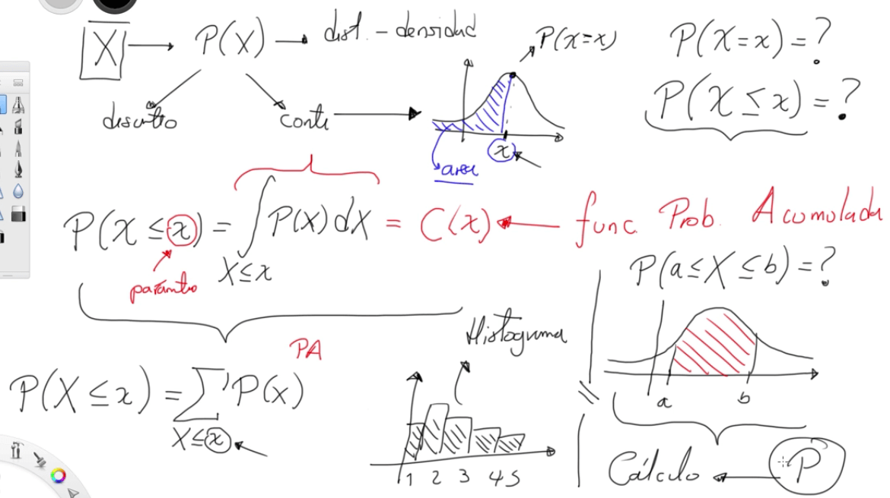

# ¿QUÉ ES UNA DISTRIBUCIÓN?

Para utilizar la probabilidad es necesario conocer de otra área de las matemáticas como son el cálculo, y en el cálculo la primera noción es el concepto de función.

Por tanto en la probabilidad lo que se hace es coger una X aleatoria y se le asigna un valor que son sus probabilidades, a esto se le conoce como distribución. Por tanto, la distribución es una función, en la cual se le asigna un X que es el espacio muestral, y a cada uno de estos elementos se halla su probabilidad.

Es común que:

El dominio de X pueden ser discretos, es decir se pueden contar sus elementos porque es un espacio finito como por ejemplo las caras de un dado o continuo donde el numero de elementos pueden ser infinito como por ejemplo la temperatura.

Un dominio continuo permite que sus valores puedan ser graficados en un plano cartesiano, lo cual es interesante por no solo se puede calcular la probabilidad en un punto dado, sino la probabilidad en una región, como por ejemplo la probabilidad en una región menor a un punto dado.

Dominio Continuo

Este cálculo puede realizarse también en dominios discretos, pero no estaría dados por graficas con curvas, sino en histogramas, por lo que para hallar la probabilidad acumulada cambia de integrales a sumatorias.

Dominio Discreto

Por ultimo, también se puede hallar la probabilidad entre dos punto en un dominio continuo por medio de la siguiente ecuación:

