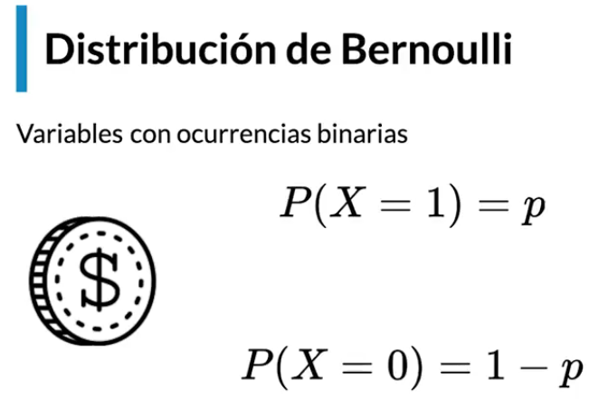
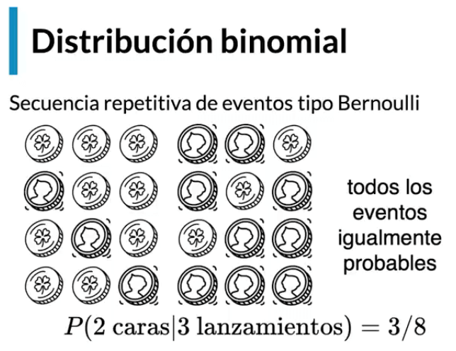
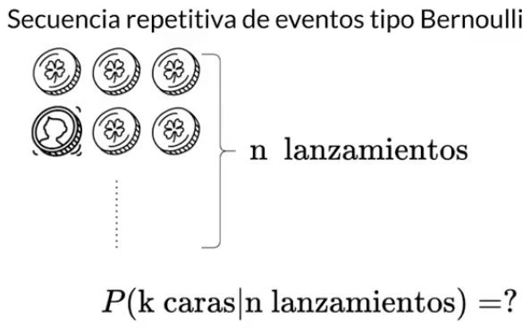
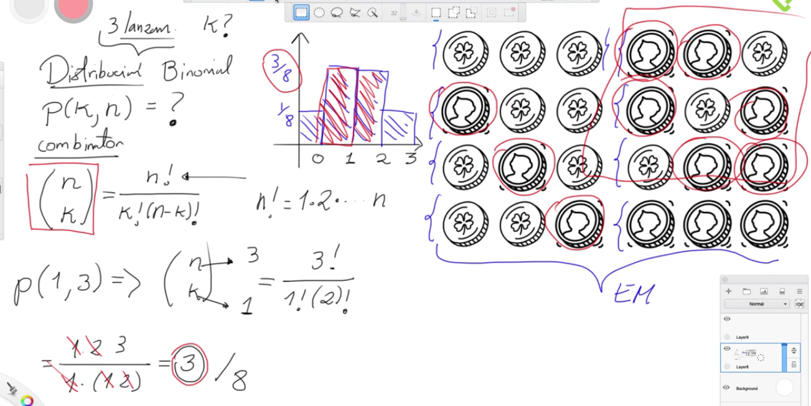
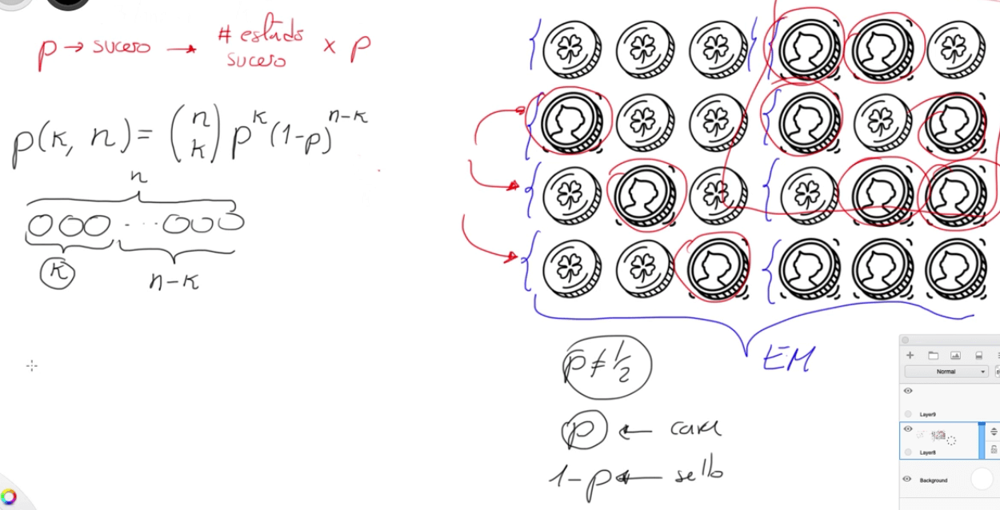
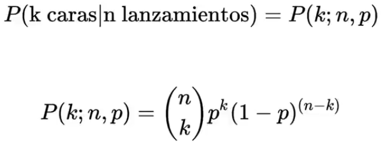
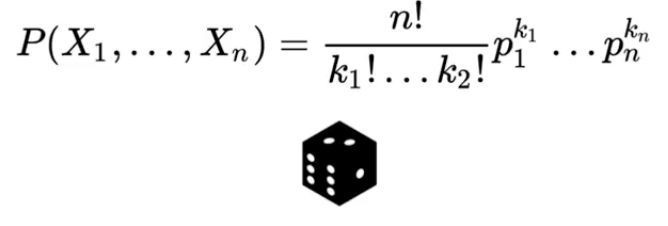

# DISTRIBUCIONES DISCRETAS

La primera distribución es la de Bernoulli, la cual es binaria, es decir es un resultado o es el otro, solo hay dos opciones como es el lanzamiento de una moneda. La probabilidad de  uno de los lados es 1 menos la probabilidad del otro lado.

Pero este problema se puede volver mas complicado si se tiene lanzamientos repetitivos, llamados eventos tipo Bernoulli. Por ejemplo, se lanza 3 monedas o 3 veces la misma moneda, el espacio muestral es de 8 posibles resultados y de esas solo 3 nos da dos caras como resultado, por tanto la probabilidad es de 3/8.

Ahora, se puede tener muchos lanzamientos, tantos como n veces se quiera, la cantidad de resultados crece de manera exponencial, por lo que la probabilidad de un resultado especifico se mantiene cambiando.

Debido a que el espacio muestral es discreto, la grafica es un histograma. El espacio muestral consta de 8 posibilidades, si contamos la posibilidad de tener 0 caras, solo vemos que hay 1/8, para una cara es de 3/8, para dos caras es de 3/8 y para tres caras 1/8. Existe una formula que se llama combinatorio y que muestra las veces que puede caer un evento:

Donde n es el numero de lanzamientos, y k el numero veces de obtener cara, ademas:

Por tanto, la formula de la distribución binomial es dado por:

 
Es de anotar, que la anterior formula solo aplica para eventos binomiales, para una distribución multinomial como por ejemplo el lanzamiento de un dado la formula es la siguiente:

Sin embargo, estas no son las únicas distribuciones de probabilidades, otras pueden ser:

- Poisson
- Geométrica
- Hipergeométrica
- Binomial negativa
- ...