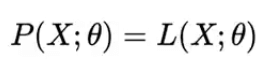
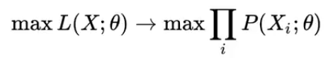
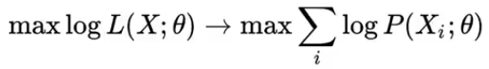

MLE: Estimación de maxima verosimilitud

MLE es un framework para estimación de densidades de probabilidad.

**Elementos de MLE**

- **Escoger la distribución:** Teniendo solo una muestra de los datos
- **Escoger los parámetros de la distribución:**  Que mejor ajustan la distribución a los datos, que nos permiten mejorar los datos, como por ejemplo, la media y la desviación estándar para una distribución gaussiana.

El problema del MLE es que se escoge una parte de los datos de un conjunto general, por lo tanto los resultados van a ser útiles para esta parte de los datos, pero no para los datos en general.  Despues de seleccionada la parte de la muestra que se va a utilizar, lo siguiente es que estos datos, nos va a dar unos parámetros que se van a utilizar para ajustar la distribución, ya que tienen una variables que se pueden ajustar.

Por lo tanto, un MLE es un problema de optimización.

Se tiene un conjunto de datos X, que vienen dados por una serie de parámetros theta, las probabilidades pueden cambiar según como se cambien theta en la función de verosimilitud L.

Dado que se empieza a cambiar los valores theta, lo que se busca es la combinación de los parámetros theta que dan un máximo de probabilidades. Otra hipótesis importante, es que la distribucción de probabilidades se puede factorizar como el producto de varias probabilidades, donde cada probabilidad corresponde a cada datapoint del dataset. Pero resulta un problema, que es cuando se multiplica valores muy pequeños, estos dan valores muchos mas pequeños, los cuales pueden aumentar el error al calcularlos por computadora, porque estos tiene un limite del numero de decimales a calcular, a esto se le conoce como un underflow.
 
 

La forma de resolver el underflow es aplicando el logaritmo a las probabilidades, ya que hay una propiedad en que el logaritmo de un producto es la suma de los logaritmos, lo que transforma una multiplicación en sumas y números muy pequeños en números negativos grandes fáciles de computar.