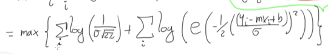

MLE: Estimación de máxima verosimilitud.

El machine learning tratar de ajustar densidades a datos, puede existir modelos supervisados como son la clasificación o la regresión, o modelos no supervisados como son la clusterización.

**Regresión lineal con MLE**

Se tiene la ecuación de la lineal recta yaque la regresión lineal se basa en esta ecuación,  sim embargo es de anotar que en machine learning se le llama peso b0 a lo que comúnmente se le llama como pendiente y se llama bias b1 a lo que normalmente se conoce como intercepto con el eje y.

Observe que para la ecuación de MLE, la probabilidad de que un resultado se de dado unos puntos x, se convierte en una suma de logaritmos de la probabilidad de las parejas y, x, calculados unos parámetros h, el cual es el modelo que se va ajustar. Recuerda que h es un modelo cualquiera, pero para este caso va a ser para un modelo lineal

 Se tiene el modelo ya definido, h es la ecuación de la línea recta, por que los parámetros que se buscan es la pendiente m y el intercepto b, para el cual el modelo se ajusta mejor. En la grafica se observa unos puntos azules que tratan seguir la línea roja que es la ecuación de la linea recta, a estos punto azules se les conoce como ruido (noise) la hipotesis es que el ruido o la desviación con respecto a la línea forman una distribución gaussiana, cuya ecuación aparece como P.

Lo primero es calcular los minimos cuadrados, que es tomar el valor y de los datos, restarle el valor y de la ecuación y para evitar valores negativos se eleva al cuadrado.

El objetivo es buscar el mínimo de esta sumatoria 

Ahora, esta ecuación es equivalente a parte del exponente de la gaussiana. Por tanto el modelo MLE queda como.

 
Dado que el log(a.b) = log(a) + log(b), la ecuación se transforma en:

Lo que sucede es que el primer logaritmo tiene términos como pi que son constantes, ademas de valores como sigma, que prácticamente no tiene mayores cambios, además que no es un parámetro que se pueda cambiar como los de la línea recta, por tanto, se puede despreciar para el cálculo esta parte y concentrarse en el segundo logaritmo. Es de anotar que logaritmo y el exponente son valores inversos, es decir que una función que se aplica otra función inversa, va a dar el mismo número. Por tanto se concentra en la parte que esta en el exponente, por tanto la ecuación queda como:

Note el menos dentro de la sumatoria, al quitarlo, cambia el máximo por un mínimo, por tanto:

Oh Sorpresa! el desarrollo de MLE se convierte en la ecuación de minimos cuadrados

