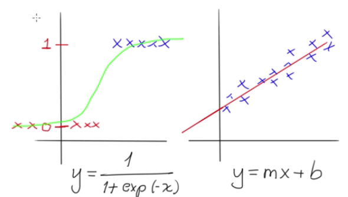

# REGRESIÓN LOGÍSTICA

Se puede observar las graficas, en la izquierda la sigmoide que permite dividir los datos en dos clases, en 0 y en 1, es decir, o es de un tipo o no es de un tipo. En la derecha la comúnmente conocida ecuación de la línea recta. La obtención de los datos en el sigmoide se conoce como regresión logística, y en  la línea recta se le conoce como regresión lineal.

Para entender la regresión logística, primero se debe comprender que el problema tiene que ver con una clasificación con atributos x1, x2, etc. Que de acuerdo con sus valores, se puede hallar el valor de la clase y, que puede ser 0 y 1. Por ejemplo puede ser si una transacción es fraudulenta (valor de y), que depende del número de tarjeta, la clave, el usuario, el monto, etc. (Atributos x's).

La forma como funciona los atributos es que a cada x's se le asigna un peso beta, la cual su suma da como resultado X que se ingresa en la ecuación del sigmoide, por lo tanto la clase y va a estar dado por un 0 o un 1, dependiendo de los atributos.

Por tanto el valor de y puede dar una probabilidad P de 0.9 y un error e de 0.1, La idea es ajustar los atributos betas para que el error sea lo mas bajo posible.

Ahora la idea es encontrar el MLE dentro de esta función de sigmoide , por tanto:

Se tiene las funciones de sigmoide y MLE

Para entender mejor el problema se  apoya en el teorema de Bernoulli, el cual la probabilidad de fracaso es 1 menos la probabilidad de éxito, los cual se puede escribir en que la probabilidad resultante es la suma de la probabilidad de que sea verdad mas la probabilidad de ser falso, el cual se acomoda en la verisimilitud L. por tanto la verosimilitud en un punto esta dado por:

Para continuar se tienen dos consideraciones:

Que la probabilidad va a ser lo mismo que el log de la probabilidad y segundo que el likelihood total es el likelihood en todos los puntos.

Por tanto el likelihood total es:

 
Al hallar el máximo valor de L, es lo mismo que decir el min de L

A este -L se le conoce como cross entropy o entropía cruzada, lo que es:

Se puede observar que esta ecuación es la ecuación de costo en los modelos de clasificación, por lo tanto hallar el mínimo de la ecuación de costo es lo mismo que hallar las máximas  verosimilitudes, que da las máximas probabilidades.