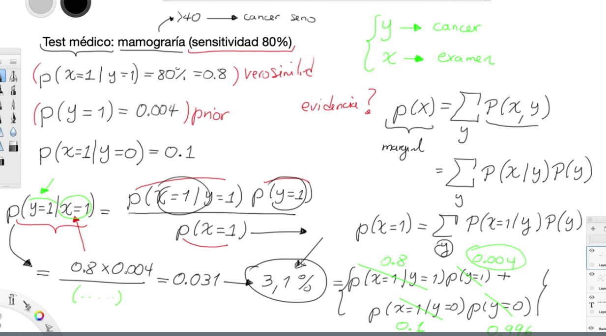

# TEOREMA DE BAYES

La escuela Bayesiana difiere fuertemente con la escuela frecuentista, este esta basado en el teorema de Bayes, elcual es:

El teorema de Bayes esta dada por tres componentes, el primero es la probabilidad a priori, que es la probabilidad basado en la creencia de que suceda, que no necesariamente es la realidad. El segundo elemento es la probabilidad de evidencia (B), que es el resultado de las evidencias que se tiene y una tercera que una probabilidad en la cual la probabilidad a priori esta condicionada por la probabilidad de la evidencia y que se conoce como la probabilidad de verosimilitud. Estas tres componentes nos da la probabilidad a posteriori. Entonces el teorema de Bayes lo que hace es ajustar la probabilidad de una creencia.

Ejemplo: Una mujer de 40 años, se tiene que hacer un test médico que se llama mamografía para detectar el cáncer de seno. En el consultorio se tiene una maquina con una sensitividad del 80%. Por lo tanto, asumiendo que la mujer tiene cáncer, la probabilidad de ser detectado por la maquina es del 80%

Las variable y o clase es que el paciente tiene o no cáncer, mientras que el x es el examen.

La probabilidad a priori, es decir la creencia de que una persona tenga cáncer de 0.004, también se sabe que la maquina puede dar falso positivos es decir, que el paciente sabiendo que no tiene cáncer, la maquina arroja positivo, el cual es P(x=1|y=0): 0.1. en este punto solo hace falta la evidencia, esta la obtenemos como:

El teorema de Bayes da un valor mas cercano de la probabilidad de tener cáncer, sabiendo las probabilidades de otros factores.

Por tanto la solucion es:

Con esto se quiere decir, que si la maquina da un resultado positivo, la probabilidad de tener cáncer es del 3.1%.

