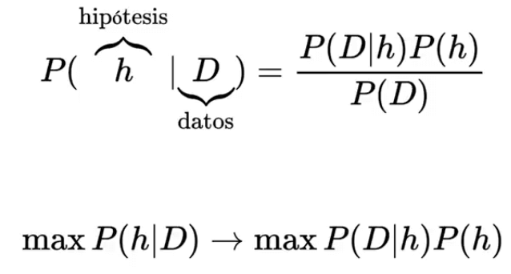
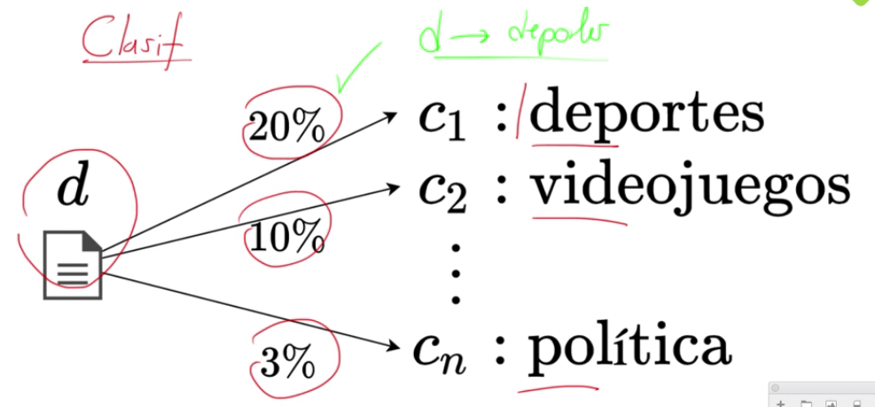
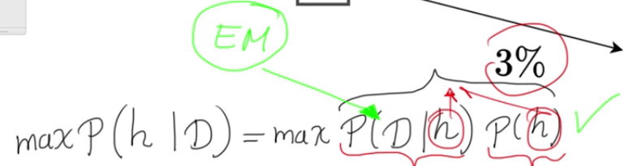
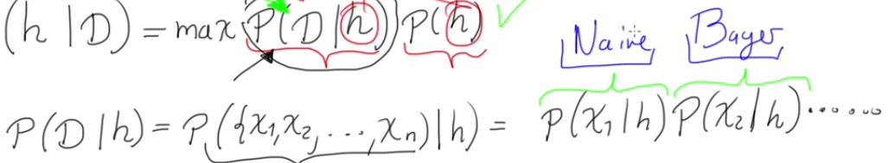
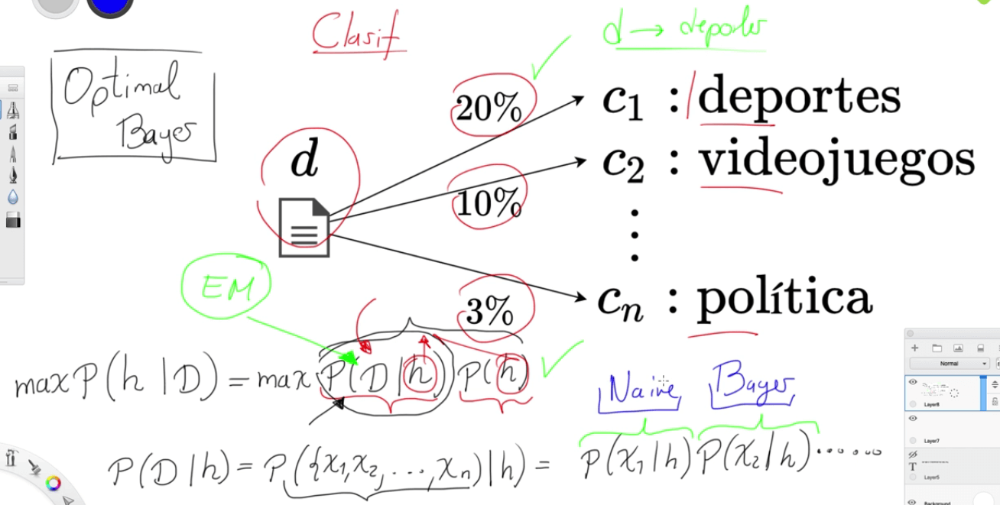

# BAYES EN MACHINE LEARNING

En la escuela frecuentista se trabaja con el MLE, sin embargo, existe un análogo para la escuela bayesiana que es conocida como MAP, que significa maximum a posteriori. Este se define en la primera ecuación, la cual teniendo un conjunto de datos D, cual es la probabilidad que se de la hipótesis del modelo h, el cuál es igual a la probabilidad de los datos según la hipótesis, multiplicado por la probabilidad de la hipótesis dividido por la probabilidad de los datos.

En el MLE, el trabajo era encontrar la máxima verosimilitud, es decir el P(D|h), sin embargo para el MAP, el objetivo es encontrar la máxima P(h|D), el cual depende de dos variables como son el P(D|h) y el P(h), note que se desprecia la evidencia P(D), ya que este no varía.

Este modelo también es utilizado para clasificadores en machine learning.

En clases anteriores se explico como funciona un clasificador para machine learning, el cuál cuando tiene un dato o documento d, el modelo extrae palabras claves para hallar la probabilidad de pertenecer a cada uno de las categorías, para después dar como resultado en la categoría con mayor porcentaje que para este caso es deportes.

Con MAP, lo que se busca es encontrar la combinación entre la probabilidad de verosimilitud y la probabilidad a priori máxima. Para el ejemplo de la regresión lineal, h es la línea recta, para la logística es la sigmoide con diferentes betas. Las probabilidades para  la verosimilitud en este caso son muy difíciles de encontrar, ya que el espacio muestral es extremadamente gigante, sin embargo si no se toma ninguna simplificación en las probabilidades, se dice que se tiene un clasificador Optimal Bayes

El segundo paso es encontrar la forma de convertir la probabilidad de verosimilitud en la multiplicación de las probabilidades por cada uno de sus datos dada su hipótesis, de tal forma que cada una de ellas sea independientes, lo cuál reduce la complejidad, dado que se reduce el espacio muestral, a esta simplificación se le conoce como Naive Bayes, y los clasificadores con este método se le conoce como clasificadores de Naive Bayes.

